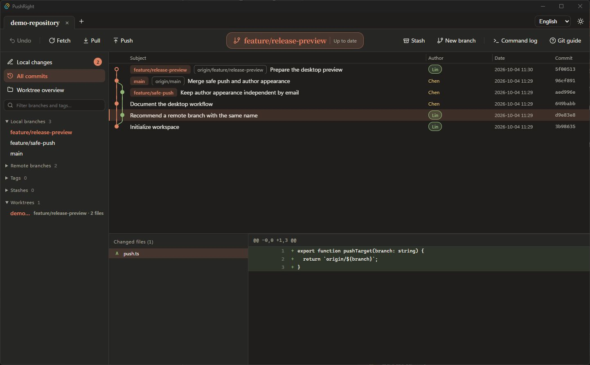
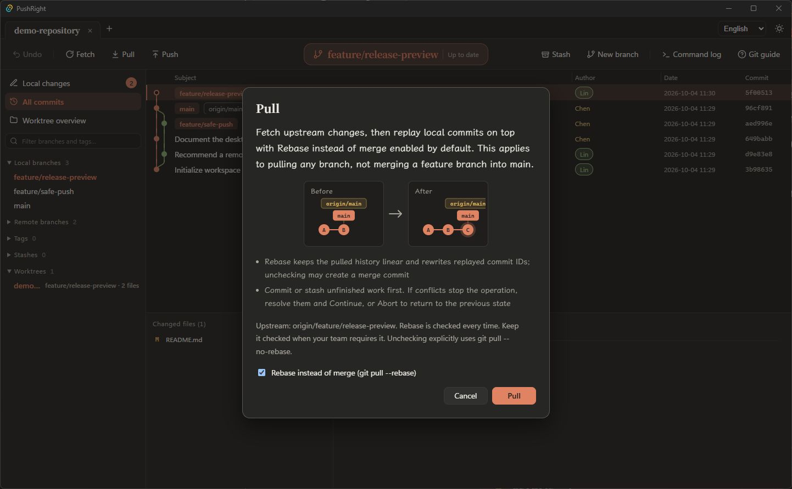
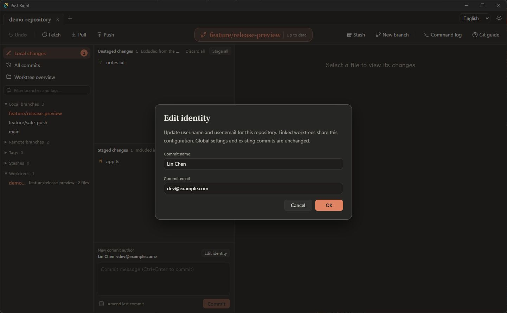

# PushRight

[English](README.md) · [简体中文](README.zh-CN.md)

面向多分支日常工作的 Git 桌面可视化客户端，使用 Svelte、Tauri 和 Rust 构建。

当前版本为 **v0.2.3 预览版**，提供 Windows x64 安装包。首次启动默认英文，内置完整英文和简体中文语言包，可在右上角切换，选择会保存在本机。界面、提示、操作说明和应用自身的错误均提供双语；仓库内容和 Git / 系统原始输出保持原文，系统原生对话框使用系统语言。

本次更新逐个列出新增目录中的未跟踪文件，修复预览时的目录访问错误，并提高分支标签的文字对比度。VS Code 扩展还会默认展开侧栏提交图，并采用更紧凑的布局。



截图来自桌面程序，使用虚构作者和本地示例仓库。

## 下载与安装

从 [GitHub Releases](https://github.com/ArthurLauCS/PushRight/releases) 下载 `PushRight_0.2.3_x64-setup.exe`，运行安装程序。

- 支持 Windows 10 / 11 x64；本次发布在 Windows x64 上构建和验证。
- 需要安装 [Git for Windows](https://git-scm.com/downloads/win)，并确保 `git` 在 PATH 中可用。
- 需要 Microsoft Edge WebView2 Runtime；缺少时安装程序会尝试联网安装。
- 安装包尚未进行代码签名，Windows 可能显示未知发布者提示。Release 附有 `SHA256SUMS.txt`，可用 PowerShell 的 `Get-FileHash .\PushRight_0.2.3_x64-setup.exe -Algorithm SHA256` 核对文件。

安装器支持英文和简体中文，应用语言独立选择。产品此前名为 GitGod；PushRight 保留应用数据标识以兼容已有设置。旧版 GitGod 可能作为独立安装保留，不会被自动删除。

首次使用前，在 Git 中配置提交身份及远程认证：

```sh
git config --global user.name "Your Name"
git config --global user.email "you@example.com"
```

PushRight 使用系统 Git 的凭据管理器或 SSH 配置；遇到认证失败，先在终端完成相应仓库的 Git 认证。应用本身不提供账号登录或交互式终端提示。

## 使用

打开应用后选择本地 Git 仓库。也可将仓库路径作为启动参数传入：

```powershell
& "C:\path\to\pushright.exe" "C:\path\to\repository"
```

### 提交与推送

1. 在工作区查看变更，按文件、差异块或选中行暂存，然后填写提交说明。
2. 推送时检查目标远程和分支。当前分支与 upstream 名称不一致时，应用要求明确选择，并优先推荐同名远程分支。
3. 推送使用明确的远程和分支 refspec。强制推送采用 `--force-with-lease`；仍需确认目标和预期影响。

例如本地 `feature/login` 误跟踪 `origin/main` 时，推送候选会优先推荐 `origin/feature/login`，避免直接沿用错误的 upstream。

### 拉取时使用变基而非合并

点击「拉取」，对话框会显示当前上游，并且每次默认勾选 **变基而非合并（Rebase instead of merge）**；即使上次取消勾选，下次仍默认开启。此对话框不能通过「下次不再显示」跳过。

- 勾选时明确执行 `git pull --rebase`，覆盖 `pull.rebase=false` 或分支级别的合并偏好。
- 取消勾选则执行 `git pull --no-rebase`，可能产生合并提交。团队要求拉取时变基，请保持勾选。
- 先提交或贮藏未完成的改动；此次拉取禁用自动贮藏和自动更新其他本地分支引用。
- 遇到冲突，解决后点击「继续」，或点击「中止」恢复原状态。变基时 Git 的「我方」是上游及已重放的提交，「对方」是正在重放的本地提交。



这是各分支拉取上游时的策略，不规定功能分支如何合入 `dev`、`main` 或 `master`，也不会审批托管平台 PR/MR；合入方式仍按仓库的独立规范执行。变基会改变重放提交的 ID，重写共享历史前应与协作者协调。参见 [Git pull 官方文档](https://git-scm.com/docs/git-pull)。

### 单独设置作者样式

在提交列表中右键某个作者，独立设置该作者的底色和边框。设置按作者原始邮箱保存；没有邮箱时按姓名匹配。同名、不同邮箱的作者不会互相影响。设置跨仓库保存在本机。

左键作者可临时聚焦其提交；作者获得键盘焦点后，按 `Shift+F10` 也可打开样式设置。

### 查看和修改提交身份

“本地更改”的提交区域显示 Git 实际使用的姓名和邮箱。点击“修改身份”，可保存当前仓库的 `user.name` 和 `user.email`，不影响全局配置或已有提交；关联工作树共享仓库配置。

如果环境变量或 `author.*` / `committer.*` / 工作树配置覆盖了这两个值，界面会显示实际身份并提示覆盖情况。修补上次提交会保留原作者，界面显示本次提交者。



### 大仓库与大文件

首屏只加载 2000 条提交，完整历史后台补齐；提交图使用紧凑骨架、每 1024 行的检查点，以及按可见窗口获取作者和标题。切换已有分支、引用重命名时，只更新标记和选中行，提交起点集合不变就复用提交图。

差异读取最多保留 4 MiB + 1 字节；超限后停止读取，Git 差异进程会被终止。超过上限的文件仍可整文件暂存或提交。

在本机的 148 万提交 Linux 仓库及 128 MiB 文件上进行了复测，环境、数据规模、结果和复现命令见 [性能记录](docs/PERFORMANCE.md)。

### 已提供的功能

- 多仓库标签页、最近仓库与会话恢复。
- 虚拟滚动提交图、分支和标签标记、提交详情及文件差异。
- 暂存、取消暂存、提交、修改上次提交；按文件、差异块或选中行处理变更。
- 分支创建、切换、重命名与删除；合并、变基、cherry-pick、revert、reset 和标签操作。
- Fetch、明确选择变基或合并的 Pull、明确选择目标的 Push，以及 stash 操作。
- Worktree 管理、冲突块处理、进行中操作的继续与中止。
- 中英语言切换、深浅主题、可调面板、独立作者样式、操作说明和命令日志。

## VS Code 扩展（预览）

扩展 **0.2.4** 新增提交内文件列表与原生差异、Auto / 全部分支 / 指定分支筛选、图内同名推送、子仓库识别，以及本机忽略和跟踪管理。

同一套引擎和界面可以在 VS Code 里运行。从 [VS Code Marketplace](https://marketplace.visualstudio.com/items?itemName=AthurLau.pushright) 安装 Windows x64 预览版，或从 [GitHub Releases](https://github.com/ArthurLauCS/PushRight/releases/tag/vscode-v0.2.4) 下载 VSIX。使用条件和边界见[扩展说明](extension/README.zh-CN.md)。也可从源码构建：

```sh
npm ci
npm run ext:package
code --install-extension extension/pushright-win32-x64-0.2.4.vsix
```

- **源代码管理面板**：已暂存、未暂存和冲突的文件；按文件或按选中的行暂存、取消暂存、丢弃；提交和修补上次提交；行号旁的改动标记和资源管理器角标。首次使用时 PushRight 会说明关闭 VS Code 自带 Git 的后果，由你决定是否关闭。
- **推拉检查**：拉取每次都询问，并默认勾选 **变基而非合并**。上游与本地分支不同名时，推送优先推荐同名远程分支，状态栏同时给出警告。强制推送使用 `--force-with-lease`，需要确认两次。
- **编辑器里的作者**：当前行末尾显示作者、时间和提交说明，悬停可看详情；整文件作者标注（`Alt+B`）可按作者或按新旧上色；文件、类和函数上方的 CodeLens；状态栏显示当前行作者。在提交图里设置的作者样式在这里同样生效；「只高亮这一行的作者」会在文件和滚动条上标出该作者写的所有行。
- **历史**：跟随当前文件的文件历史、选中行的行历史、上一版 / 下一版对比（`Alt+,` / `Alt+.`）、与任意分支、标签或提交对比，以及按提交说明、作者、文件、改动内容或提交号搜索提交。
- **提交图**：执行「PushRight: 打开提交图」，桌面版的界面会在编辑器页签里打开。

尚未包含：macOS、Linux 和远程开发（WSL / SSH）版本，PR / Issue 集成，交互式变基编辑器，自动定时获取。子模块需要先初始化。

## 当前边界

- 桌面版和 VS Code 扩展均为预览版。PR / Issue 和托管平台协作集成尚未交付。
- 提交列表只渲染可见行，但完整历史仍会在后台读取；超大仓库的时间和内存开销需要进一步实测优化。
- 超过 4 MiB 的补丁不显示完整差异。读取限制约束的是应用保留的数据，Git 子进程在输出补丁前仍可能消耗较多时间和内存。
- 提交图最多显示 24 条轨道，实际数量随面板宽度变化；高度并行的复杂历史可能无法显示所有连线。
- 尚未提供自动更新，也未发布 macOS / Linux 安装包。
- 部分操作提供撤销入口，并非所有 Git 操作都能撤销；删除分支、丢弃变更、重置等操作前应检查提示。

## 本地开发

需要 Node.js 24、Rust stable，以及 Windows 的 MSVC C++ 工具链和 Windows SDK。完整环境要求见 [Tauri 官方文档](https://v2.tauri.app/start/prerequisites/)。

```sh
npm ci
npm run desktop:dev
```

`npm run dev` 只启动前端网页，不能独立调用桌面 Git 后端。

检查与构建：

```sh
npm run check
npm test
cargo test -p engine
npm run desktop:build
npm run ext:build   # VS Code 扩展：引擎子进程、面板和扩展主机
npm run ext:smoke   # 在临时的 VS Code 配置里跑一遍扩展
```

Windows 安装包输出到 `target/release/bundle/nsis/`。首次构建可能需要联网下载 Rust 依赖及 NSIS 打包工具。安装包构建方式见 [Tauri Windows Installer 文档](https://v2.tauri.app/distribute/windows-installer/)。

目录：

| 路径 | 职责 |
| --- | --- |
| `src/` | Svelte 界面、提交图、操作交互 |
| `src/lib/locales/` | 完整英文和简体中文语言包 |
| `crates/engine/` | Rust Git 引擎：gix 读取、Git CLI 操作 |
| `crates/sidecar/` | 把引擎包成子进程，供 VS Code 扩展调用 |
| `extension/` | VS Code 扩展：源代码管理、作者标注、历史和提交图面板 |
| `src-tauri/` | 桌面窗口、命令接口和安装包配置 |
| `tests/` | 前端回归检查 |

## 反馈与许可

请在 [Issues](https://github.com/ArthurLauCS/PushRight/issues) 中提交问题，附上版本、系统、复现步骤和必要日志；分享日志前请移除凭据及私密仓库信息。

第三方组件的许可声明见 [THIRD_PARTY_NOTICES.txt](THIRD_PARTY_NOTICES.txt)，安装目录也包含该文件。仓库公开不代表已授予本项目的开源使用许可；项目许可证尚待作者确定。
